# PawDash - Production CI/CD

_Your app is now live and running on AWS with a complete CI/CD pipeline._

## Next steps

1. **View your live application**  
   _Get it into users hands, go write that blog post!_  
   [View your app in production](https://feat1.dziroqmttt9bl.amplifyapp.com)

2. **Manage your app and pipelines in the AWS Console**  
   _Monitor performance, view logs, configure custom domains, and manage deployments directly from the AWS Console._
   - [Manage app in Amplify](https://us-east-1.console.aws.amazon.com/amplify/apps/dziroqmttt9bl/overview)
   - [View your pipeline in CodePipeline](https://us-east-1.console.aws.amazon.com/codesuite/codepipeline/pipelines/pawdash01-pipeline/view)

3. **Improve your infrastructure**  
   _As your app changes, your cloud infrastructure needs to change with it._

   **Type one of the following in the chat, or type your specific needs:**

   _Do you want to scale your infrastructure? Try:_

   > Help me scale my infrastructure.

   _Don't want the app anymore? Try:_

   > Tear down my app.

## Your Cloud Infrastructure

_Here is a breakdown of the services used to support your app._

| Service      | Benefit                                                                                                                  |
| ------------ | ------------------------------------------------------------------------------------------------------------------------ |
| Amplify      | Automated builds and deployments for web apps [Learn more](https://aws.amazon.com/amplify/)                              |
| S3           | Scalable object storage for static files [Learn more](https://aws.amazon.com/s3/)                                        |
| CodePipeline | Continuous delivery service for fast and reliable application updates [Learn more](https://aws.amazon.com/codepipeline/) |
| CodeBuild    | Fully managed build service that compiles source code [Learn more](https://aws.amazon.com/codebuild/)                    |
| CloudFront   | Global content delivery network for low-latency access [Learn more](https://aws.amazon.com/cloudfront/)                  |

## Deployment Architecture

_The diagram shows key components of your deployment architecture._

```mermaid
architecture-beta
    group aws(cloud)[AWS Cloud]

    service developer(person)[Developer]
    service amplify(server)[AWS Amplify] in aws
    service s3(storage)[S3 Bucket for Static Assets] in aws
    service cloudfront(cdn)[CloudFront for Global CDN] in aws
    service users(person)[End Users]


    developer:R --> L:amplify
    amplify:R --> L:s3
    s3:R --> L:cloudfront
    cloudfront:R --> L:users
```

## Deployment Details

| Resource          | Value                                            |
| ----------------- | ------------------------------------------------ |
| App ARN           | `arn:aws:amplify:us-east-1:625164594347:apps/dziroqmttt9bl`              |
| Region            | `us-east-1`              |
| CodePipeline Name | `pawdash01-pipeline`    |
| CodePipeline ARN  | `arn:aws:codepipeline:us-east-1:625164594347:pawdash01-pipeline`     |
| CodeBuild Project | `pawdash01-build`    |
| CodeBuild ARN     | `arn:aws:codebuild:us-east-1:625164594347:project/pawdash01-build` |
| Github Repository | `https://github.com/PawDash/PawDashApp`           |
| CDN               | Amazon CloudFront                                |