# PawDash - Preview

_Your personal preview environment is created directly from your local code - perfect for demos, testing, and sharing prototypes with stakeholders._

## Next steps

1. View and share your app
   _Test it and/or share it with stakeholders. NOTE: This app is public._ 
   [Open your app](https://main.d1ifad8nbrmehn.amplifyapp.com)

2. Manage your app in the Amplify console
   _Monitor performance, view logs, configure custom domains, and manage deployments._ 
   [Open the Amplify console](https://us-east-1.console.aws.amazon.com/amplify/apps/d1ifad8nbrmehn/overview)

3. Go live!
   _Get production ready and set up a complete CI/CD pipeline. You'll be able to automatically deploy when you push to Git, have rollback capabilities, view build history and logs, and have your build process run in the cloud._

   **Type the folowing in the chat:**

   > Set up my app for production.

## Preview Architecture

_This diagram shows how your local code was deployed to AWS Amplify._

```mermaid
architecture-beta
    group local(laptop)[Local Development]
    group aws(cloud)[AWS Cloud]

    service developer(person)[Developer] in local
    service buildFolder(storage)[Build Folder] in local
    service s3(storage)[S3 Bucket] in aws
    service amplify(server)[AWS Amplify] in aws
    service cloudfront(cdn)[CloudFront CDN] in aws
    service users(person)[Preview Users]

    developer:R --> L:buildFolder
    buildFolder:R --> L:s3
    s3:R --> L:amplify
    amplify:R --> L:cloudfront
    cloudfront:R --> L:users
```

## Preview Details

_Here is a breakdown of the services used to support your app._

| Resource            | Value                                    |
| ------------------- | ---------------------------------------- |
| **Deployment Type** | Personal Preview (Local → AWS)           |
| **App ARN**         | `arn:aws:amplify:us-east-1:625164594347:apps/d1ifad8nbrmehn` |
| **S3 Bucket**       | `pawdash01-preview-deployments` |
| **Region**          | `us-east-1`      |
| **Source**          | Local Build Folder                       |